# Nightcore Dolphin "Spring" video making

Anton Antonov
[MathematicaForPrediction at WordPress](http://mathematicaforprediction.wordpress.com)
[MathematicaForPrediction at GitHub](https://github.com/antononcube/MathematicaForPrediction)
May 2023

## Introduction

This notebook shows how to make [Nightcore](https://en.wikipedia.org/wiki/Nightcore) modifications to a song video. We use [Dolphin](https://dolphinmusic.ru)'s song "Spring" ("Весна").

**Remark:** We use "Spring" since its licencing allows copies of it to be (publicly) played [via YouTube](https://www.youtube.com/watch?v=8UsR9L3KPIU).

The Nightcore transformation of the song was fairly straightforward with Mathematica / WL. The video transformation and combination are also fairly straightforward or easy.

**Remark:** Here is the final result uploaded to YouTube: 

## Get movies

Here is a link to the official video: https://www.youtube.com/watch?v=P47V4SASwGc .

I downloaded the videos from after searching yandex.ru (dzen.ru). Alternatively, one can find and download videos in Firefox or Google Chrome via relevant plugins. (Or use [VLC](https://www.videolan.org/vlc/); or utilize the paclet described in the post ["Playing with YouTube from Mathematica"](https://b3m2a1.github.io/playing-with-youtube-from-mathematica.html), [BMI1].)

At this point I have a small official video and larger one. This gives the opportunity to demonstrate transferring of the "Dolphin" signature from the "official" video to the larger one. (See the frame manipulation below.)

Here we import the downloaded small "official" video:

```mathematica
vdSpring0 = Import["~/Downloads/Dolphin-Spring-videoclip.mp4"]
```

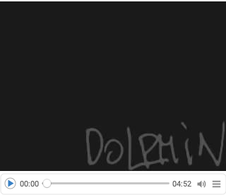

Here we import the larger downloaded video:

```mathematica
vdSpring = Import["~/Downloads/Дельфин \[LongDash] Весна.mp4"]
```

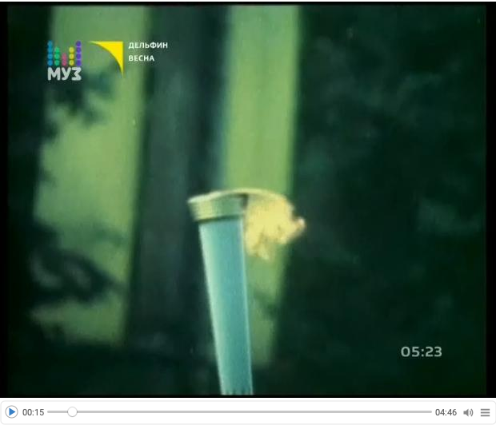

## Getting Dolphin's "signature"

Here we is the first frame from the "official" video:

```mathematica
frameSign = VideoExtractFrames[vdSpring0, 0]
```

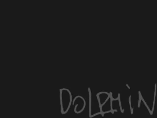

Here we binarize the image:

```mathematica
frameSignBW = Binarize[lsFrame0]
```


Before adding that image to video frames it is resized, darkened, and "smoothed." Something like this:

```mathematica
ImageEffect[#, "OilPainting"] &@Darker[ImageResize[frameSignBW, 2*ImageDimensions[frameSignBW]], 0.7]
```


## Make Nightcore audio

The process for making a song Nightcore is described in Wikipedia, [Wk1]. Basically, we just make the tempo 20-30% faster and raise the pitch with, $\approx 5.5$ semitones.

**Remark:** An alternative of the process shown in this section is to use audio transformation programs like [Audacity](https://www.audacityteam.org) and [AmadeusPro](https://apps.apple.com/us/app/amadeus-pro/id438292371?mt=12).

Here we get the audio from the video:

```mathematica
auSpring = Audio[vdSpring]
```

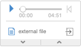

Here we change the tempo to be 20% faster: 

```mathematica
AbsoluteTiming[
  auSpringFaster = AudioTimeStretch[auSpring, 1/1.2] 
 ]
```

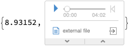

Here we raise the pitch with $5.5$ semitones:

```mathematica
AbsoluteTiming[
  auSpringNightcore = AudioPitchShift[auSpringFaster, Quantity[5.5, "Semitones"]] 
 ]
```

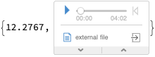

## Get lyrics

Although, we have a video with English subtitles, it would be interesting to experiment with adding subtitles to the video or "discovering" the subtitles in the video frames.

Instead of just copy-&-pasting the text I took screenshot of lyrics here: https://lyrics-on.net/en/1096839-vesna-vesna-lyrics.html 

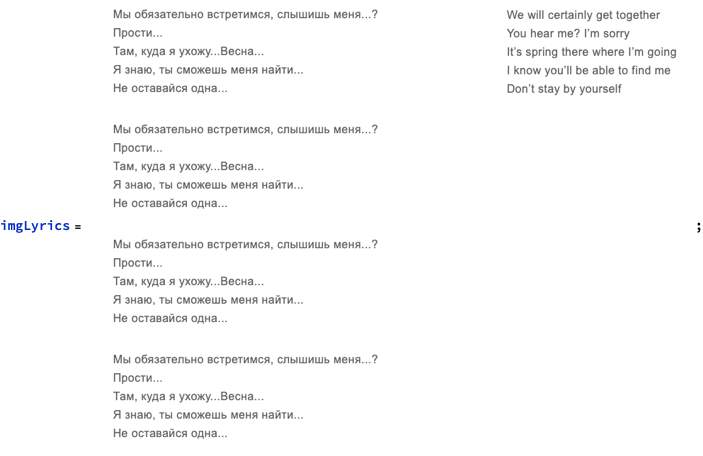

Here the image above is split into two halves and they displayed in a grid:

```mathematica
imgLyrics1 = ImageTake[imgLyrics, All, {1, ImageDimensions[imgLyrics][[2]]/1.3}];
imgLyrics2 = ImageTake[imgLyrics, All, {ImageDimensions[imgLyrics][[2]]/1.3, -1}];
GraphicsGrid[{{imgLyrics1, imgLyrics2}}, Dividers -> All, ImageSize -> 700]
```

Here we recognize the lyrics within each half:

```mathematica
Grid[{{TextRecognize[imgLyrics1, Language -> "Russian"], TextRecognize[imgLyrics2, Language -> "English"]}}, Dividers -> All]
```

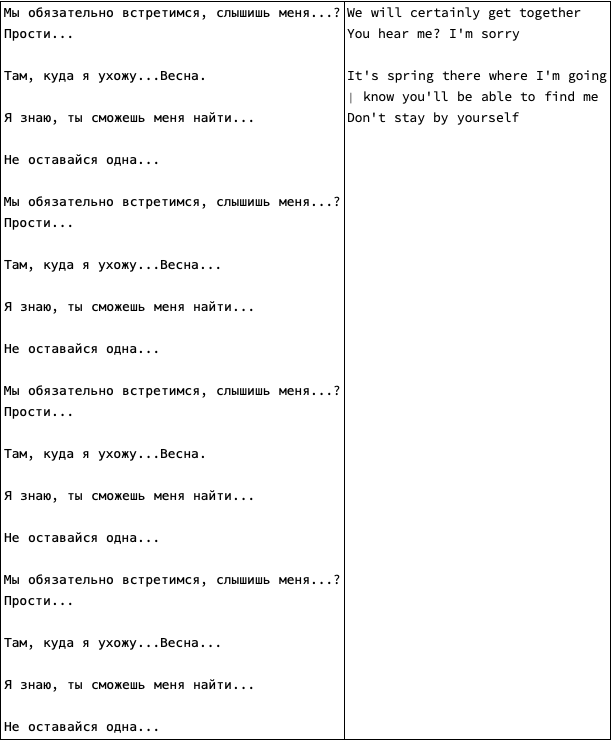

**Remark:** Because we found a video with subtitles, we do not use further the extracted lyrics in this notebook.

## Direct video styling

If we only wanted to change how the video *looks* we can directly manipulate the video frames with VideoFrameMap, [WRI6] :

```mathematica
AbsoluteTiming[
  k = 0; 
  vdSpring4 = VideoFrameMap[Switch[Mod[k++, 500] < 250, True, EdgeDetect[#], False, ImageEffect[#, "EdgeStylization"]] &, vdSpring]; 
 ]

(*{1221.98, Null}*)
```

```mathematica
vdSpring4
```

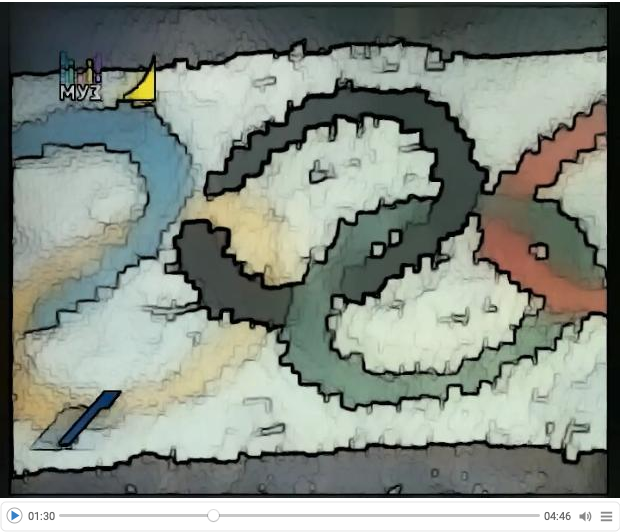

**Remark:** Since we want to make both the audio and video shorter we have to use video frames.

## Make Nightcore video

Get the frames of the video:

```mathematica
AbsoluteTiming[
  lsFrames = VideoExtractFrames[vdSpring, All]; 
 ]

(*{8.04196, Null}*)
```

Show the number of frames:

```mathematica
Length[lsFrames]

(*7156*)
```

Change all the frames to have the "ColorBoosting" image effect:

```mathematica
AbsoluteTiming[
  lsFramesBoost = ParallelMap[ImageEffect[#, "ColorBoosting"] &, lsFrames]; 
 ]

(*{239.268, Null}*)
```

Here we resize the "signature" image, "smooth" it,  and then add it to all of the "boosted" frames:

```mathematica
AbsoluteTiming[
  lsFramesBoostSigned = 
    Block[{frameSignBW = ImageEffect[#, "OilPainting"] &@Darker[ImageResize[frameSignBW, ImageDimensions[lsFramesBoost[[1]]]], 0.85]}, 
     Map[ImageAdd[#, frameSignBW] &, lsFramesBoost] 
    ]; 
 ]

(*{8.61014, Null}*)
```

Here is how the 10-th frame looks like: 

```mathematica
lsFramesBoostSigned[[10]]
```

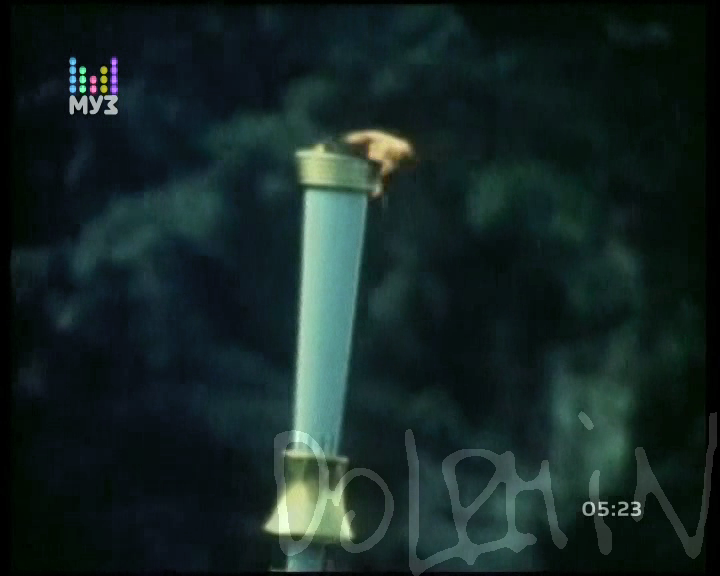

Generate (audio-less) video from the list of frames that have the same length as the generated audio:

```mathematica
AbsoluteTiming[
  vdSpringNew = VideoGenerator[lsFramesBoostSigned, Duration[auSpringNightcore]]; 
 ]

(*{95.209, Null}*)
```

Combine the video and audio (into a new video):

```mathematica
AbsoluteTiming[
  vdSpringNightcore = VideoCombine[{vdSpringNew, auSpringNightcore}]; 
 ]

(*{0.07271, Null}*)
```

```mathematica
vdSpringNightcore
```

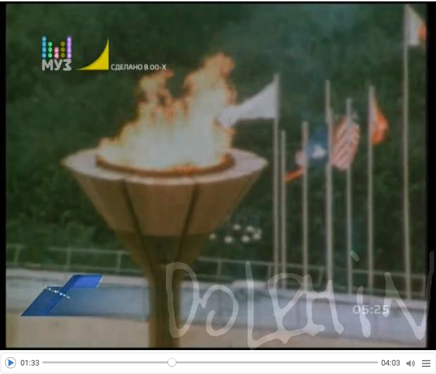

**Remark:** Here we do not export the video, since Mathematica saves it in a "standard" location of the host operating system.

## References

[BMA1]  b3m2ma1, ["Playing with YouTube from Mathematica"](https://community.wolfram.com/groups/-/m/t/1484511), (2018), Wolfram Community. ([GitHub link](https://b3m2a1.github.io/playing-with-youtube-from-mathematica.html).)

[DM1] Dolphin, https://dolphinmusic.ru .

[Wk1] Wikipedia entry, ["Nightcore"](https://en.wikipedia.org/wiki/Nightcore).

[WRI1] Wolfram Research (2010), TextRecognize, Wolfram Language function, https://reference.wolfram.com/language/ref/TextRecognize.html (updated 2020).

[WRI2] Wolfram Research (2016), Audio, Wolfram Language function, https://reference.wolfram.com/language/ref/Audio.html (updated 2020).

[WRI3] Wolfram Research (2016), AudioTimeStretch, Wolfram Language function, https://reference.wolfram.com/language/ref/AudioTimeStretch.html (updated 2020).

[WRI4] Wolfram Research (2016), AudioPitchShift, Wolfram Language function, https://reference.wolfram.com/language/ref/AudioPitchShift.html (updated 2020).

[WRI5] Wolfram Research (2020), VideoExtractFrames, Wolfram Language function, https://reference.wolfram.com/language/ref/VideoExtractFrames.html.

[WRI6] Wolfram Research (2020), VideoFrameMap, Wolfram Language function, https://reference.wolfram.com/language/ref/VideoFrameMap.html (updated 2021).

[WRI7] Wolfram Research (2008), ImageEffect, Wolfram Language function, https://reference.wolfram.com/language/ref/ImageEffect.html (updated 13).

[WRI8] Wolfram Research (2020), VideoGenerator, Wolfram Language function, https://reference.wolfram.com/language/ref/VideoGenerator.html (updated 2021).

[WRI9] Wolfram Research (2020), VideoCombine, Wolfram Language function, https://reference.wolfram.com/language/ref/VideoCombine.html.